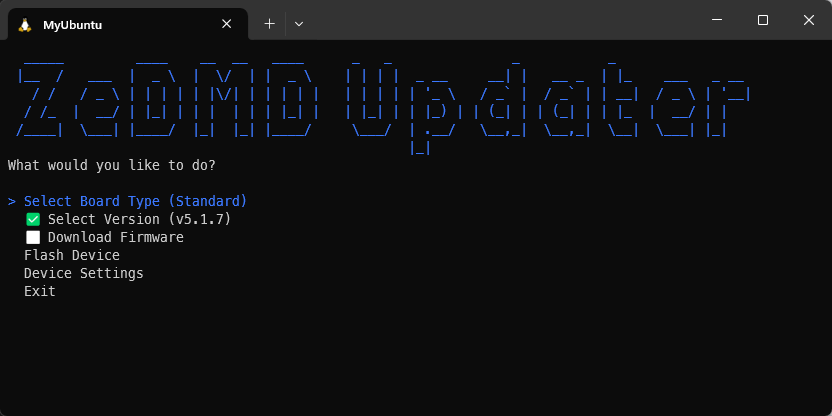

# ZeDMD Updater

A universal (Windows, Linux, MacOS) command-line utility to update firmware on ZeDMD displays.



## Features

- Support for multiple board types:
  - ESP32
  - ESP32-S3
  - LilygoS3Amoled (with optional WiFi support)
- Firmware version selection
- Easy-to-use interactive menu
- Device settings configuration

## Prerequisites

- Windows, Linux, or macOS
- [.NET 8.0 runtime](https://dotnet.microsoft.com/en-us/download/dotnet/8.0) or later for your OS
- [esptool](https://github.com/espressif/esptool) (`esptool.exe` or `esptool`) in the same folder as ZeDMDUpdater

### For Windows WSL Users

Ensure you have [usbipd-win](https://github.com/dorssel/usbipd-win) installed to expose the ZeDMD device:

```bash
usbipd list
usbipd bind --busid=<your-device-busid>
usbipd attach --wsl --busid=<your-device-busid>
```

## Usage

1. Connect your ZeDMD display to your computer
2. Run the application:

    ```shell
    ./ZeDMDUpdater
    ```

3. Follow the interactive menu to:

   - Select your board type
   - Choose firmware version
   - Download firmware
   - Flash your device
   - Configure device settings (coming)